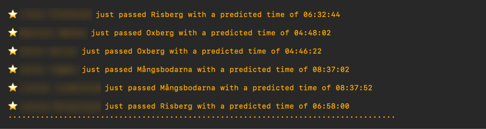

# Vasarazzi ⛷️ 📸

Tänkte jag skulle följa lite kompisar på årets vasa men... Det kostar monis. 🥰

Uppdateras var 10e sekund!

## Setup

Leta upp `idp` för personerna du följer. Det gör du genom att söka upp personen på följande sida och klicka in dig på personens resultatsida.

Plocka ut det som står efter `idp=`
> https://results.vasaloppet.se/2024/?content=detail&...&`idp=XOXOGOSSIP`&...

I detta fallet är `XOXOGOSSIP` vårt `idp`

Upprepa för varje person du vill följa och spara på nåt bra ställe

## Köra 

`bun src/index.ts idp1,idp2,idp3`

## Frivilligt

### Support för pusnotiser

Vasarazzi använder sig utav [Pushover](https://pushover.net/)
- Skaffa ett konto
  - Skapa en `Application/API Token`
  - Skriv ner
- Installera appen på din mobil
  - Leta upp `User Key`
  - Skriv ner

Kopiera `.env.sample` och döp om till `.env`
Fyll i med uppgifterna du skrev ner innan.

Pang ping pong. 🏓